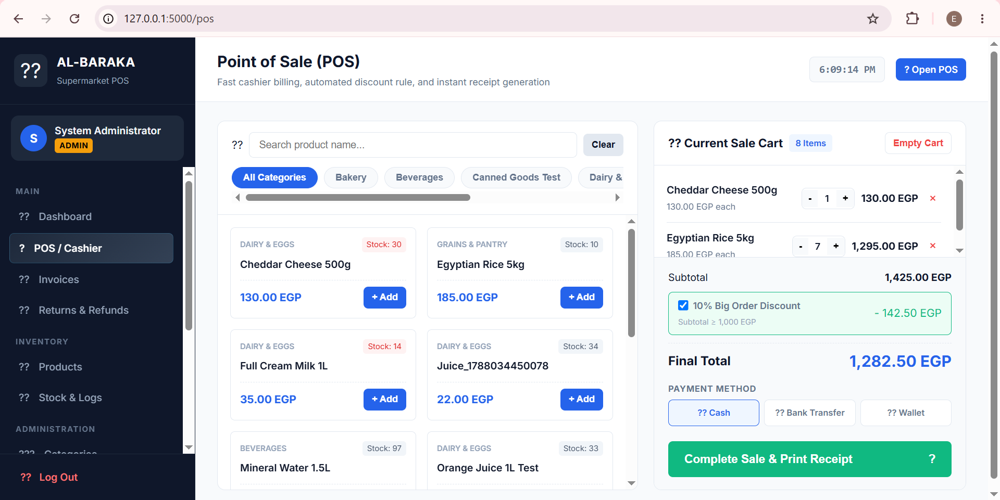
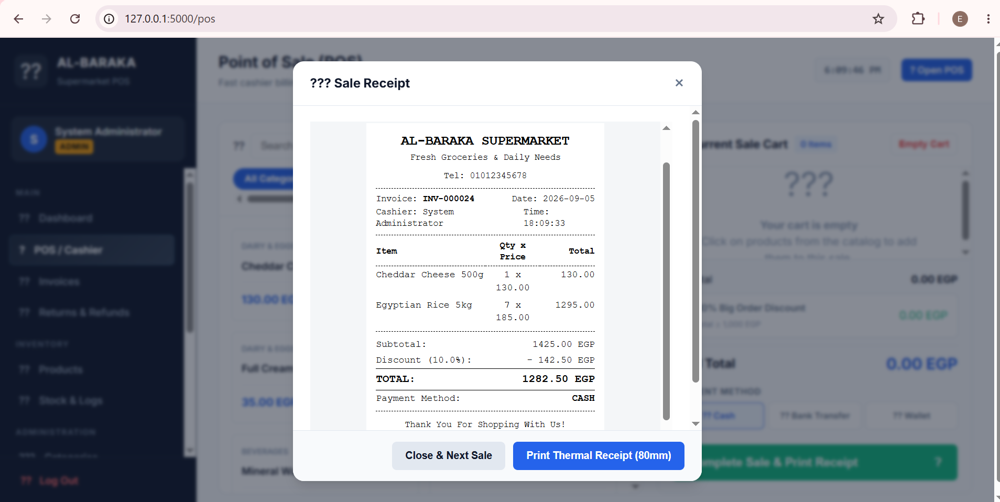
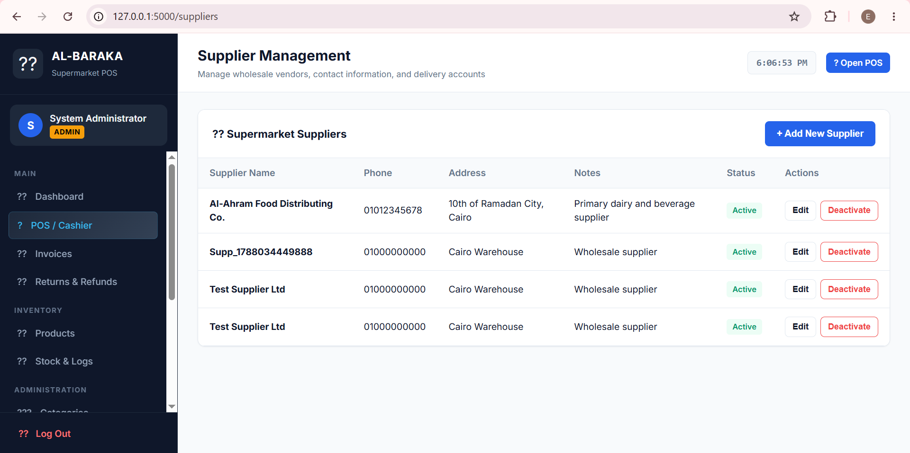

# 🛒 Al-Baraka Supermarket POS & Inventory Management System

A desktop-based supermarket management system designed to support daily retail operations, including point of sale, inventory management, products, invoices, returns, stock tracking, and user management.

## 📌 Project Overview

The system provides a centralized interface for managing supermarket sales and inventory operations.

It includes role-based access for different users, allowing administrators and cashiers to access the functions relevant to their roles.

## ✨ Key Features

- 🛒 Point of Sale (POS) and cashier operations
- 📦 Product and inventory management
- 📊 Stock tracking and stock logs
- 🧾 Invoice management
- 🔄 Returns and refunds
- 👥 User management and role-based access
- 🏷️ Product categories
- 💰 Discount management
- 💳 Multiple payment methods
- 🖨️ Receipt generation
- 📈 Dashboard and operational overview

## 🗄️ Database

The system uses **SQLite** as a local database for storing and managing application data.

## 🖼️ Screenshots

### 🔐 Login

### 📊 Dashboard

### 🛒 Point of Sale (POS)

### 🧾 Invoices

### 📦 Products

### 📊 Stock & Logs

### 👥 User Management

## 🎯 Project Purpose

This project was developed as a practical example of applying business and operational requirements to a real-world supermarket management system.

It demonstrates the integration of sales operations, inventory management, user roles, and database-driven application functionality within one system.

## 🛠️ Technology

- Desktop / Local Application
- SQLite Database

## 👩‍💻 Project

**Al-Baraka Supermarket POS & Inventory Management System**

Developed as a practical business application and portfolio project.
