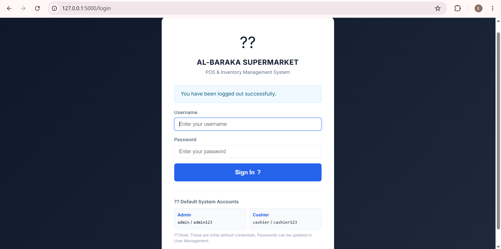
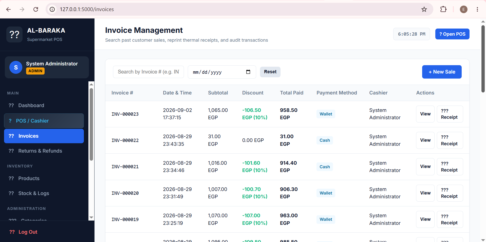
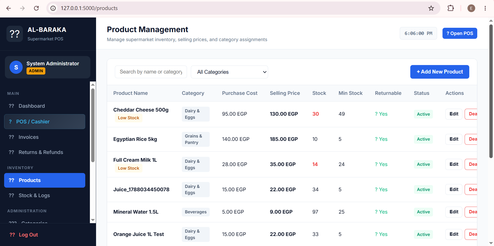
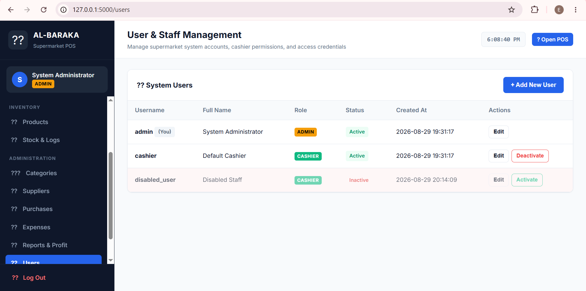

# Al-Baraka Supermarket POS & Inventory Management System

A desktop-based supermarket management system designed to support daily retail operations, including point of sale, inventory management, products, invoices, suppliers, and user management.

## Project Overview

The system provides a centralized interface for managing supermarket sales and inventory operations.

It includes role-based access for different users, allowing administrators and cashiers to access the functions relevant to their roles.

## Key Features

- Point of Sale (POS) and cashier operations
- Product and inventory management
- Stock tracking and stock logs
- Invoice management
- Receipt generation and printing
- Returns and refunds
- User management and role-based access
- Product categories
- Supplier management
- Discount management
- Multiple payment methods
- Dashboard and operational overview

## Database

The system uses SQLite as a local database for storing and managing application data.

## Screenshots

### Login

### Point of Sale (POS)

### Receipt

### Invoices

### Products

### Suppliers

### User Management

## Project Purpose

This project was developed as a practical supermarket management system to support sales, inventory, supplier, and user management operations.

It demonstrates how business requirements can be translated into a functional desktop application using a local database.

## Technology

- Desktop / Local Application
- SQLite Database
